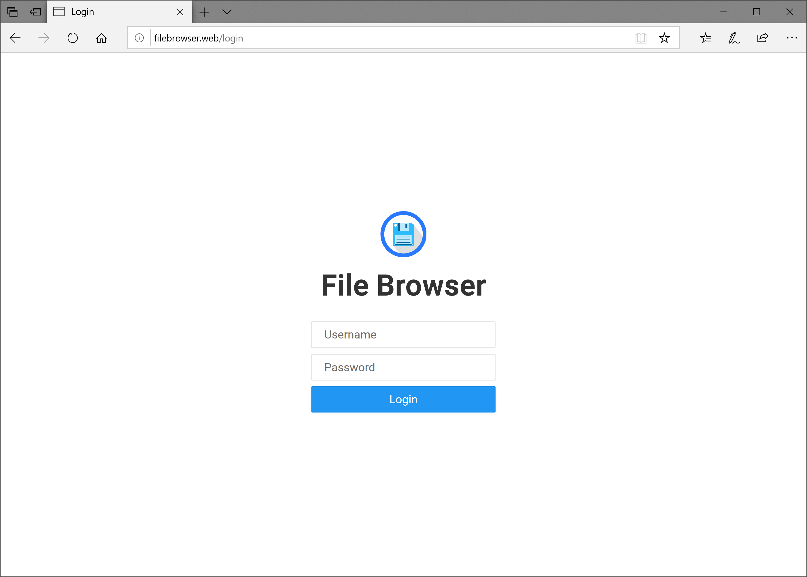
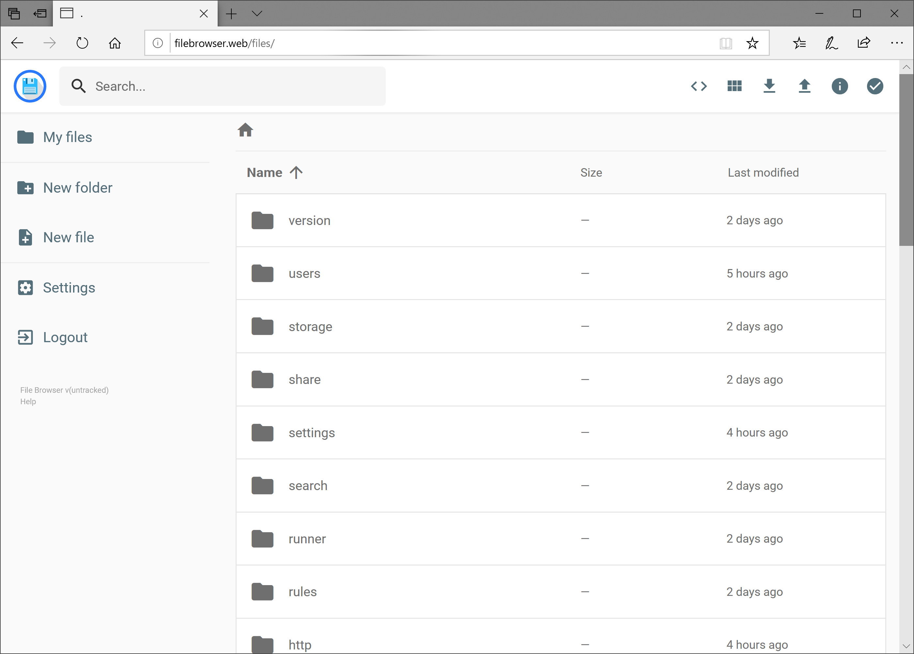
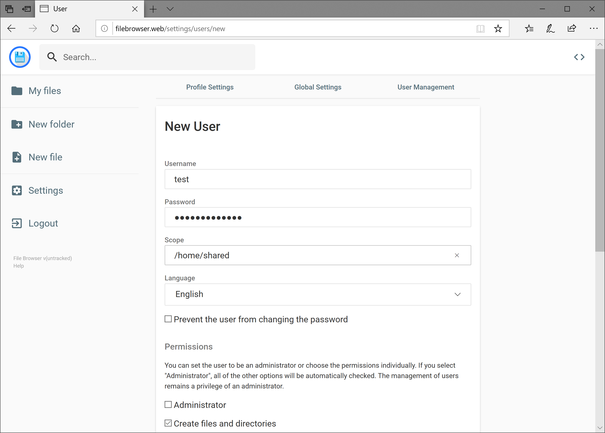
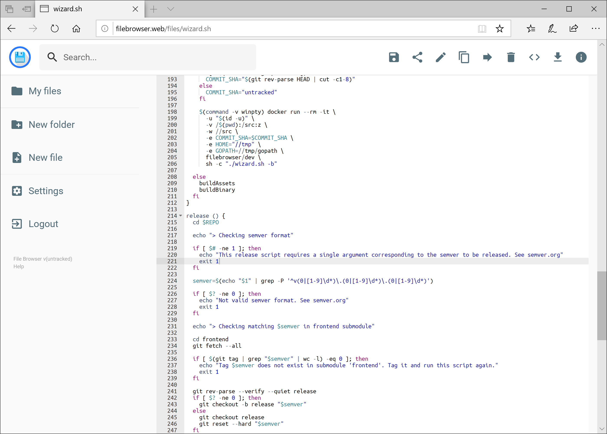
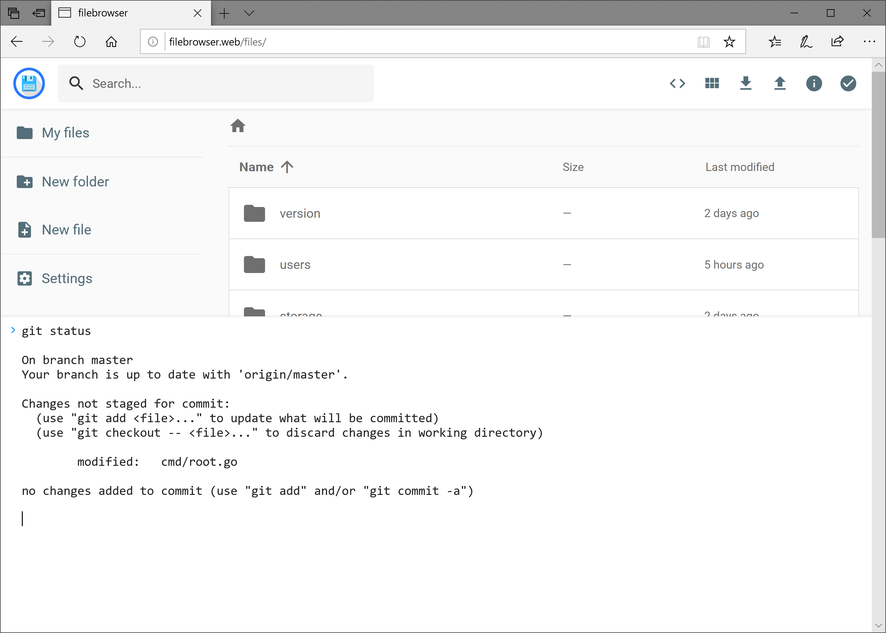

# TODO IMAGES #

File Browser is a **create-your-own-cloud-kind** of software where you can install it on a server, direct it to a path and then access your files through a nice web interface. You have many available features!

